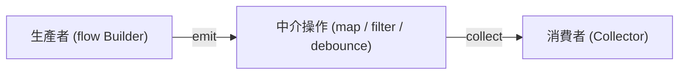

# 🤖 Android Kotlin Flow 異步串流與 MVVM 實戰指南

在 Android 現代化開發（Modern Android Development, MAD）中，**Kotlin Coroutines（協程）** 與 **Flow（非同步串流）** 已經成為處理非同步資料流的業界標準。

本指南旨在為您深入剖析 Kotlin Flow 的核心概念，對比傳統 LiveData，並提供在 MVVM 架構下進行**生命週期安全收集（Lifecycle-aware Collecting）**的企業級實戰範例。

---

## 🧭 核心概念：什麼是 Kotlin Flow？

**Flow** 是 Kotlin 協程庫中提供的一種**非同步冷流（Cold Stream）**。它能夠以響應式程式設計（Reactive Programming）的方式，依序發送多個計算結果，並在協程的保護下安全地處理背壓（Backpressure）與執行緒切換。

### ❄️ 冷流 (Cold Stream) vs 🔥 熱流 (Hot Stream)

在串流開發中，理解「冷流」與「熱流」的差異是寫出高效能程式碼的關鍵：

| 比較維度 | ❄️ 冷流 (Flow / ChannelFlow) | 🔥 熱流 (StateFlow / SharedFlow) |
| :--- | :--- | :--- |
| **啟動機制** | **被動啟動**。只有當有收集者（Collector）開始呼叫 `collect` 時，串流內部的代碼才會開始執行。 | **主動運行**。不論是否有收集者，串流都在記憶體中處於活動狀態，並持續廣播資料。 |
| **資料共享** | **獨享數據**。每個新的收集者都會重新觸發一次完整的 Flow 執行，彼此數據互不干擾。 | **共享數據（Multicast）**。多個收集者共享同一個熱流數據源，接收相同的廣播值。 |
| **狀態快取** | 無快取。只負責發送，不保留歷史資料。 | 支援狀態快取。例如 `StateFlow` 會保留最後一個發送的值；`SharedFlow` 可設定重播（Replay）次數。 |
| **常見用途** | 資料庫查詢（Room）、網路 API 響應、單次檔案讀取等單向被動操作。 | ViewModel 狀態發佈、全域事件總線（Event Bus）、使用者輸入事件廣播。 |

---

## 🛠️ Flow 的三大要素與基礎操作

一個 Flow 串流的生命週期包含三個部分：**生產者（Producer）**、**中介操作符（Intermediary）**、**消費者（Consumer）**。



### 1. 建立串流 (Producer)
使用 `flow { ... }` 建構器來建立一個冷流，並使用 `emit()` 發送資料：
```kotlin
fun getNumbersFlow(): Flow<Int> = flow {
    for (i in 1..3) {
        delay(1000) // 模擬耗時的非同步操作
        emit(i)     // 發送資料
    }
}
```

### 2. 中介變換 (Intermediary Operators)
中介變換是**惰性求值（Lazy）**的，它們只會返回一個新的 Flow，而不會開始執行串流。
```kotlin
val doubledEvenFlow = getNumbersFlow()
    .filter { it % 2 == 0 } // 只保留偶數
    .map { it * 2 }         // 將數值乘 2
```

### 3. 收集終端 (Consumer)
終端操作符（如 `collect`）是 **掛起函數（Suspending Functions）**，呼叫它們才會真正觸發 Flow 生產者開始工作：
```kotlin
lifecycleScope.launch {
    doubledEvenFlow.collect { value ->
        println("收到變換後的數值: $value")
    }
}
```

---

## 🔥 StateFlow 與 SharedFlow：MVVM 的狀態發佈神器

在 Android MVVM 架構中，我們需要用「熱流」來向 UI 層廣播狀態。Kotlin 提供了 `StateFlow` 與 `SharedFlow` 來取代傳統的 `LiveData`。

### 1. 🟢 StateFlow：專注於「狀態管理」
`StateFlow` 是一個**保留最新狀態的熱流**。它非常適合用來代表 UI 的當前 State（例如加載中、加載成功、錯誤）。

* **特點**：
  * **必須提供初始值**。
  * 永遠快取最新發送的值，當新的訂閱者（如 Fragment 重建）訂閱時，會**立刻收到當前快取的最新狀態**（防丟失）。
  * 只有在值確實改變時（`oldValue != newValue`）才會發送，具備自動去重（Distinct）功能。

#### ViewModel 實戰配置：
```kotlin
class UserViewModel(private val repository: UserRepository) : ViewModel() {
    
    // 1. 內部可寫的 MutableStateFlow
    private val _uiState = MutableStateFlow<UserUiState>(UserUiState.Loading)
    
    // 2. 對外公開唯讀的 StateFlow
    val uiState: StateFlow<UserUiState> = _uiState.asStateFlow()

    fun fetchUserData() {
        viewModelScope.launch {
            _uiState.value = UserUiState.Loading
            try {
                val user = repository.getUser()
                _uiState.value = UserUiState.Success(user)
            } catch (e: Exception) {
                _uiState.value = UserUiState.Error(e.message ?: "未知錯誤")
            }
        }
    }
}
```

### 2. 🔵 SharedFlow：專注於「單次事件」
`SharedFlow` 是一個**高度自訂的熱流**，適用於發送「一次性事件」（如顯示 Toast、SnackBar、彈出視窗或頁面跳轉）。

* **特點**：
  * **不需要初始值**。
  * 預設不會快取歷史值（`replay = 0`）。當新的訂閱者加入時，不會重播過去的事件，只會接收後續發生的新事件，有效防止「一次性事件被重複觸發」的 Bug。

#### ViewModel 實戰配置：
```kotlin
class UserViewModel : ViewModel() {
    
    // 一次性導航事件
    private val _navigationEvent = MutableSharedFlow<NavigationTarget>()
    val navigationEvent: SharedFlow<NavigationTarget> = _navigationEvent.asSharedFlow()

    fun onUserSaveClicked() {
        viewModelScope.launch {
            // 發送一次性事件，通知 UI 進行跳轉
            _navigationEvent.emit(NavigationTarget.ProfilePage)
        }
    }
}
```

---

## 🛡️ Android 核心：生命週期安全的安全收集 (Lifecycle-aware Collection)

> [!WARNING]
> **嚴禁直接在 `lifecycleScope.launch` 中直接收集（Collect）Flow！**
> 如果直接使用 `lifecycleScope.launch { flow.collect { ... } }`，當 App 進入背景（Background，如使用者按下 Home 鍵），協程仍會在背景持續收集資料並浪費 CPU/記憶體資源，甚至導致記憶體洩漏與背景崩潰！

Android 官方推薦使用 **`repeatOnLifecycle`** 或 **`flowWithLifecycle`** 進行安全收集。當生命週期低於指定狀態（如 `STARTED`）時，它們會**自動暫停並銷毀內部收集協程**；當回到該狀態（如回到前台）時，會**自動重新啟動收集**。

### 🌟 實戰：在 Activity / Fragment 中安全收集

```kotlin
class UserProfileActivity : AppCompatActivity() {

    private val viewModel: UserViewModel by viewModels()
    private lateinit var binding: ActivityUserProfileBinding

    override fun onCreate(savedInstanceState: Bundle?) {
        super.onCreate(savedInstanceState)
        binding = ActivityUserProfileBinding.inflate(layoutInflater)
        setContentView(binding.root)

        // 安全地收集 UI 狀態 (StateFlow) 與單次導航事件 (SharedFlow)
        observeViewModel()
    }

    private fun observeViewModel() {
        // 使用 lifecycleScope 啟動協程
        lifecycleScope.launch {
            // 當生命週期處於 STARTED 狀態以上時開始執行，低於時自動暫停並釋放資源
            lifecycle.repeatOnLifecycle(Lifecycle.State.STARTED) {
                
                // 收集 UI 狀態 (StateFlow)
                launch {
                    viewModel.uiState.collect { state ->
                        renderUiState(state)
                    }
                }

                // 收集導航事件 (SharedFlow)
                launch {
                    viewModel.navigationEvent.collect { target ->
                        handleNavigation(target)
                    }
                }
            }
        }
    }

    private fun renderUiState(state: UserUiState) {
        when (state) {
            is UserUiState.Loading -> binding.progressBar.isVisible = true
            is UserUiState.Success -> {
                binding.progressBar.isVisible = false
                binding.userNameText.text = state.user.name
            }
            is UserUiState.Error -> {
                binding.progressBar.isVisible = false
                showToast(state.message)
            }
        }
    }

    private fun handleNavigation(target: NavigationTarget) {
        // 執行跳轉頁面邏輯
    }
}
```

---

## 📖 Android Kotlin Flow 常用中英文術語白話對照表

為了讓您在閱讀英文文檔與社群討論時無縫對接，以下為您整理關鍵術語對照表：

| 英文術語 | 中文對照 | 💡 白話大意解釋 |
| :--- | :--- | :--- |
| **Reactive Stream** | 響應式串流 | 像水流一樣隨時間源源不絕產生的資料流。 |
| **Producer** | 生產者 / 發送端 | 串流的源頭，負責計算資料並用 `emit()` 發送出來。 |
| **Consumer** | 消費者 / 接收端 | 串流的終點，呼叫 `collect()` 接收並處理資料。 |
| **Cold Stream** | 冷流 | 像水龍頭。沒人轉開它（呼叫 collect）就不會流出半滴水，每開一次都流出全新的水。 |
| **Hot Stream** | 熱流 | 像收音機廣播。不管你有沒有開機收聽，廣播電台（StateFlow）都在那裡持續播送。 |
| **Emit** | 發射 / 發送 | 生產者把一個新資料放進串流中的動作。 |
| **Collect** | 收集 / 訂閱 | 消費者正式接通串流，開始監聽並處理資料的動作。 |
| **Backpressure** | 背壓 | 當生產者發送資料的速度，遠大於消費者處理資料的速度時，造成的系統壓力負荷。 |
| **Lifecycle-aware** | 生命週期感知 | 指程式碼會自動根據 Activity/Fragment 的生命週期暫停或釋放，防範背景浪費資源。 |
| **Multicast** | 多路廣播 / 共享發送 | 熱流將同一份資料源共享給多個訂閱者，而不是為每個訂閱者重新跑一遍計算。 |
