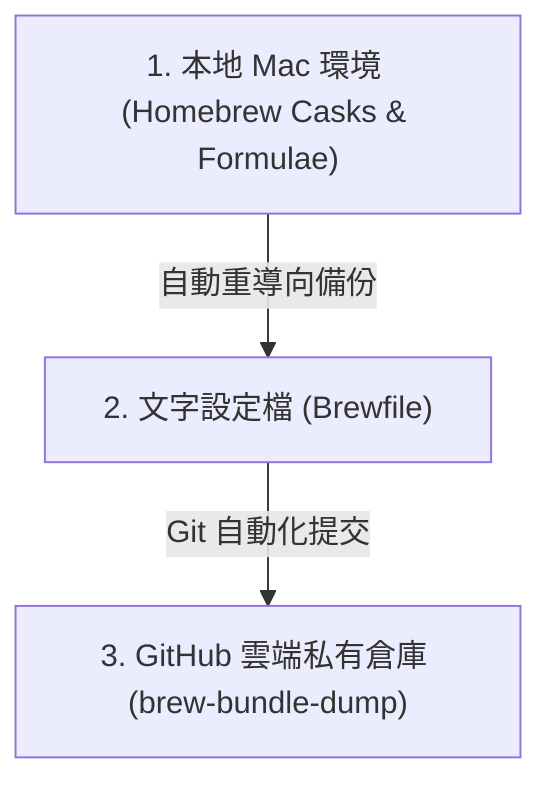

# 📦 macOS 環境工程：使用 Homebrew 與 Git 打造自動化備份系統

對於程式設計師與電力使用者（Power Users）來說，重灌電腦或更換全新 Mac 時，最痛苦的莫過於**重建開發環境與重新安裝那幾十個軟體**。

本指南將向您介紹一套資深工程師愛用的 **「環境即代碼」（Environment as Code, EaC）** 自動化備份系統。這套系統結合了 **Homebrew Bundle (Brewfile)**、**Git 版本控制** 與 **輕量級 Bash 自動化腳本**，能夠讓您在換電腦時「一鍵還原」所有系統軟體、開發套件與桌面 App，且能每天自動同步備份至您的 Git 私有倉庫！

---

## 🧭 自動化備份系統的三大架構

這套系統的核心思想是將「本地安裝的所有軟體」轉換為「文字設定檔」，並利用 Git 進行雲端同步：



---

## 🛠️ 核心組件一：配置純淨的 `Brewfile`

`Brewfile` 是我們環境的「DNA 藍圖」。我們可以使用 `brew bundle dump` 指令來自動掃描當前電腦中透過 brew 安裝的所有軟體。

在自動化備份中，為了保持設定檔的「純淨度與跨電腦相容性」，我們會加入以下兩個非常關鍵的參數：
```bash
brew bundle dump -f --no-npm --no-vscode
```
* **`-f` (Force)**：強制覆寫舊有的 `Brewfile`，確保備份永遠是最新的。
* **`--no-npm`**：不備份透過 npm 全域安裝的 Node 套件（因為這通常改由 `nvm` 或專案 `package.json` 去管理，不屬於系統級軟體）。
* **`--no-vscode`**：不備份 VS Code 的擴充插件清單（因為 VS Code 現在自建了 Settings Sync 帳號同步功能，不需重複備份於系統中）。

---

## 🛠️ 核心組件二：自動化備份腳本 (`backup.sh`)

為了免去每天手動輸入 `dump`、`add`、`commit`、`push` 等繁瑣 Git 操作，我們可以編寫一個高容錯、全自動運行的 **`backup.sh`** 腳本：

```bash
#!/bin/bash

# 1. 切換到腳本所在的目錄，確保不管在哪裡執行，路徑都是對的
cd "$(dirname "$0")" || exit

echo "🔄 1. 正在從遠端拉取最新進度 (git pull)..."
git pull

echo "📦 2. 正在更新 Brewfile (brew bundle dump -f --no-npm --no-vscode)..."
brew bundle dump -f --no-npm --no-vscode

echo "➕ 3. 正在將檔案加入版本控制 (git add -A)..."
git add -A

# 取得當下的日期作為 Commit Message，格式為 YYYY-MM-DD
COMMIT_MESSAGE=$(date +"%Y-%m-%d")

echo "📝 4. 正在提交更改 (git commit -m \"$COMMIT_MESSAGE\")..."
# 【高階技巧】防錯機制：只有在偵測到「確實有軟體變更」時才進行 commit，避免 Git 空白提交報錯中斷！
if ! git diff-index --quiet HEAD --; then
    git commit -m "$COMMIT_MESSAGE"
else
    echo "沒有任何變更需要提交。"
fi

echo "🚀 5. 正在推送到遠端 (git push)..."
git push

echo "✅ 備份與同步完成！"
```

### 💡 腳本內建的高階技巧分析：
* **`cd "$(dirname "$0")" || exit`**：這行非常重要！它能動態獲取腳本本身的實體路徑並切換進去。這代表不論您是在家目錄、桌面還是在 Cron Job 背景執行它，**它都絕對能精準找到對的 Git 目錄，而不會發生路徑錯亂！**
* **`git diff-index --quiet HEAD`**：這是標準 Git 生態中的檢測法。如果不加這行，在軟體清單沒有任何變動時強行 commit，Git 就會報出 `nothing to commit, working tree clean` 的錯誤，導致整個自動化流程中斷。這行能讓腳本「只有在軟體有增減時」才進行日期標籤的提交。

---

## 🚀 核心組件三：如何設定「全自動觸發」？

有了備份腳本，我們有兩種極佳的觸發方式，讓備份完全不需人為介入：

### 方案 A：終端機別名觸發 (Terminal Alias)
您可以將備份指令綁定在您每天都會開啟的終端機（Zsh）中。
1. 打開您的 Zsh 設定檔 `~/.zshrc`。
2. 加上一行自訂快速鍵（別名）：
   ```bash
   alias brew-sync="~/your-repo-path/backup.sh"
   ```
3. 往後您只需要在終端機隨手輸入 **`brew-sync`**，整台電腦的軟體與開發環境就會在一秒鐘內自動備份並同步上傳至雲端！

### 方案 B：macOS launchd 定時任務 (完全無感自動化)
利用 macOS 系統內建的 `launchd` 守護行程，設定讓電腦每天深夜自動執行備份。

1. 在 `~/Library/LaunchAgents/` 資料夾下，新增一個名為 `com.user.brewbackup.plist` 的設定檔：
   ```xml
   <?xml version="1.0" encoding="UTF-8"?>
   <!DOCTYPE plist PUBLIC "-//Apple//DTD PLIST 1.0//EN" "http://www.apple.com/DTDs/PropertyList-1.0.dtd">
   <plist version="1.0">
   <dict>
       <key>Label</key>
       <string>com.user.brewbackup</string>
       <key>ProgramArguments</key>
       <array>
           <string>/Users/您的使用者名稱/備份倉庫路徑/backup.sh</string>
       </array>
       <key>StartCalendarInterval</key>
       <dict>
           <key>Hour</key>
           <integer>23</integer> <!-- 每天晚上 11 點自動執行 -->
           <key>Minute</key>
           <integer>00</integer>
       </dict>
       <key>StandardOutPath</key>
       <string>/tmp/brew_backup.log</string>
       <key>StandardErrorPath</key>
       <string>/tmp/brew_backup_err.log</string>
   </dict>
   </plist>
   ```
2. 載入並啟用這個定時任務：
   ```bash
   launchctl bootstrap gui/$(id -u) ~/Library/LaunchAgents/com.user.brewbackup.plist
   ```
   **大功告成！往後每天晚上 11 點，電腦就會在您完全無感的情況下，自動把整台 Mac 的軟體安裝狀態同步到您的 GitHub 私有倉庫！**

---

## 🔒 最佳安全實踐：為什麼必須使用「私有倉庫」？

`Brewfile` 中會詳細記錄您電腦中安裝的所有軟體。出於安全考慮，**強烈建議將此備份倉庫設定為「GitHub 私有倉庫（Private Repository）」**。

1. **避免資訊洩露**：公開的安裝清單可能會讓惡意人士得知您電腦中安裝的舊版軟體、特定防毒軟體或企業 VPN 工具，進而尋找安全性漏洞。
2. **私鑰金鑰保護**：如果在同一個倉庫備份了 `.zshrc` 等環境設定檔，其中可能包含您的 API Key、Token 或個人路徑，私有倉庫能為這些敏感資料提供絕對的安全屏障。
