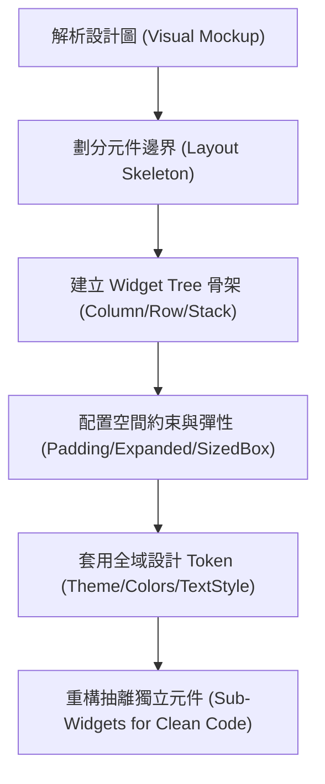

# 資深工程師必備 Flutter UI 切版與畫面整合指南

本頁面為 **Flutter 切版與畫面處理** 的綜合分析指南。我們整合了元件樹觀念、排版佈局元件以及文字色彩美學，為您設計了一個**「企業級高質感卡片 (Premium Product Card)」**的完整實戰程式碼。

藉由這個範例，您將理解資深工程師是如何將約束傳遞、彈性比例分配與主題化樣式完美融合的。

---

## 🎨 核心整合架構 (Integration Architecture)

在實作複雜的 Flutter 畫面時，資深工程師會遵循以下步驟：


---

## 💻 實戰：企業級產品卡片元件 (Premium Product Card)

以下是一份可以直接複製到您的 Flutter 專案中運行的完整程式碼。它展示了如何精準控制切版、文字外觀與色彩配置，並附有資深工程師級別的詳細註解：

```dart
import 'package:flutter/material.dart';

class PremiumProductCard extends StatelessWidget {
  final String imageUrl;
  final String category;
  final String title;
  final double price;
  final double rating;
  final VoidCallback onFavoritePressed;
  final VoidCallback onAddToCartPressed;

  const PremiumProductCard({
    super.key,
    required this.imageUrl,
    required this.category,
    required this.title,
    required this.price,
    required this.rating,
    required this.onFavoritePressed,
    required this.onAddToCartPressed,
  });

  @override
  Widget build(BuildContext context) {
    return Container(
      width: 320.0, // 限制卡片總寬度
      decoration: BoxDecoration(
        color: Colors.white,
        borderRadius: BorderRadius.circular(16.0), // 圓角
        boxShadow: [
          BoxShadow(
            color: const Color(0xFF0F172A).withOpacity(0.06), // 現代感極淡陰影
            blurRadius: 15.0,
            offset: const Offset(0, 10),
          ),
        ],
      ),
      child: Column(
        crossAxisAlignment: CrossAxisAlignment.start, // 內容由左至右排列
        mainAxisSize: MainAxisSize.min, // 縱向只佔用必要的高度
        children: [
          // 區塊 1：圖片區 (利用 Stack 疊加收藏按鈕與圖片)
          Stack(
            children: [
              ClipRRect(
                borderRadius: const BorderRadius.vertical(top: Radius.circular(16.0)),
                child: Image.network(
                  imageUrl,
                  height: 180.0,
                  width: double.infinity,
                  fit: BoxFit.cover, // 圖片滿版裁切
                ),
              ),
              Positioned(
                top: 12.0,
                right: 12.0,
                child: IconButton(
                  onPressed: onFavoritePressed,
                  icon: const Icon(Icons.favorite_border, color: Colors.white),
                  style: IconButton.styleFrom(
                    backgroundColor: const Color(0xFF0F172A).withOpacity(0.4), // 磨砂玻璃感背景
                  ),
                ),
              ),
            ],
          ),
          
          // 區塊 2：文字與細節資訊區 (使用 Padding 留白，保持效能)
          Padding(
            padding: const EdgeInsets.all(16.0),
            child: Column(
              crossAxisAlignment: CrossAxisAlignment.start,
              children: [
                // 類別標籤 (小字體、淡顏色、大寫)
                Text(
                  category.toUpperCase(),
                  style: const TextStyle(
                    color: Color(0xFF2563EB), // 品牌科技藍
                    fontSize: 12.0,
                    fontWeight: FontWeight.w700,
                    letterSpacing: 1.2,
                  ),
                ),
                const SizedBox(height: 6.0), // 垂直微調間距
                
                // 商品標題 (大字體、深顏色、限高限制)
                Text(
                  title,
                  maxLines: 2,
                  overflow: TextOverflow.ellipsis, // 超出範圍顯示「...」
                  style: const TextStyle(
                    color: Color(0xFF0F172A), // 深灰黑色
                    fontSize: 18.0,
                    fontWeight: FontWeight.bold,
                    height: 1.3,
                  ),
                ),
                const SizedBox(height: 12.0),
                
                // 評分與價格區 (橫向排列，使用 Row)
                Row(
                  mainAxisAlignment: MainAxisAlignment.spaceBetween, // 左右對齊
                  children: [
                    // 評分 (星星 icon + 分數)
                    Row(
                      children: [
                        const Icon(Icons.star, color: Color(0xFFF59E0B), size: 18.0),
                        const SizedBox(width: 4.0),
                        Text(
                          rating.toString(),
                          style: const TextStyle(
                            color: Color(0xFF475569),
                            fontWeight: FontWeight.w600,
                            fontSize: 14.0,
                          ),
                        ),
                      ],
                    ),
                    
                    // 價格
                    Text(
                      "\$${price.toStringAsFixed(2)}",
                      style: const TextStyle(
                        color: Color(0xFF0F172A),
                        fontSize: 20.0,
                        fontWeight: FontWeight.w800, // 價格粗體強調
                      ),
                    ),
                  ],
                ),
                const SizedBox(height: 16.0),
                
                // 區塊 3：加入購物車按鈕 (滿版、品牌主色)
                SizedBox(
                  width: double.infinity,
                  height: 48.0,
                  child: ElevatedButton(
                    onPressed: onAddToCartPressed,
                    style: ElevatedButton.styleFrom(
                      backgroundColor: const Color(0xFF2563EB), // 主色
                      foregroundColor: Colors.white,            // 文字顏色
                      shape: RoundedRectangleBorder(
                        borderRadius: BorderRadius.circular(8.0), // 按鈕微圓角
                      ),
                      elevation: 0,
                    ),
                    child: const Text(
                      '加入購物車',
                      style: TextStyle(fontSize: 16.0, fontWeight: FontWeight.bold),
                    ),
                  ),
                ),
              ],
            ),
          ),
        ],
      ),
    );
  }
}
```

---

## 🛠️ 資深工程師的切版思維拆解

1. **`ClipRRect` 的使用**：
   如果您直接在 `Column` 中塞入圖片，圖片本身的直角會破壞 `Container` 設好的 `BorderRadius.circular(16.0)`。資深工程師會用 `ClipRRect` 將圖片上方圓角裁切，完美維持整體美觀。
2. **`maxLines` 與 `ellipsis` 的安全防禦**：
   在真實專案中，文字長度由 API 返回，長短不一。不加限制的文字會導致畫面溢出（黃黑相間的 Overflow 條紋警告 ⚠️）。加裝限制並以點點點（Ellipsis）結尾，是資深工程師寫 UI 的標配。
3. **`SizedBox` 的空間間隔**：
   不隨意在 `Row` 或 `Column` 內層用大卡片包裝子元件，而是直接插入 `SizedBox` 來留出特定間距，保持程式碼清晰且維護高效率。

---

## 🔗 Related Topics
* [Flutter 元件樹與宣告式 UI](../concepts/flutter-widget-tree.md) — 了解 `StatelessWidget` 生命週期。
* [Flutter 基礎切版佈局](../concepts/flutter-layout-basics.md) — 拆解 `Column`、`Row` 與 `Stack` 的屬性。
* [Flutter 文字樣式與色彩設計](../concepts/flutter-text-styling.md) — 色彩宣告與主題化引用。
